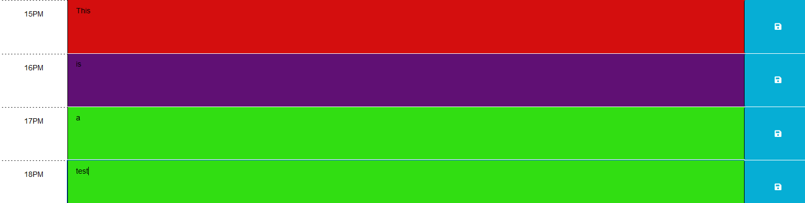

# 05 Third-Party APIs: Work Day Scheduler 📆

## Table of contents 🚀

* [Introduction 💣](#introduction-💣)
* [Requirements 🧑‍💻](#requirements-🧑‍💻)
* [How to use it 🚩](#how-to-use-it-🚩)
* [Feedback 💌](#feedback-💌)
* [Deployed links ✏️](#deployed-links-✏️)
* [Credits](#credits)

## Introduction 💣

Welcome to your digital daily planner! With this tool, you can easily manage your busy schedule and stay on top of important events. The planner displays events in different colors based on their relationship to the current time, with past events in red🟥, current events in purple🟪, and future events in green🟩.

To add an event, simply click the "Save Button" and enter the event details. You can edit or delete existing events by clicking on them. The planner is powered by HTML, CSS, JavaScript and it uses days.js library to provide the current day and time.

Thank you for choosing our planner, we hope it helps you make the most of your time and stay organized. If you have any questions or feedback, please let us know.

## Requirements 🧑‍💻

* Internet connection 🖥️

* A web browser (Google Chrome, Firefox, Safari, etc.) 🌍

* JavaScript enabled 🟨

* days.js library 📚

## How to use it 🚩

1. Open the planner in a web browser by entering the URL or open index.html if you are running it locally
2. Enter the event details
3. Click the save icon to save the event, it will be stored for future use 

4. You can edit or delete events by clicking on them

## Feedback 💌

We would love to hear your feedback and suggestions for how we can improve the planner. Please don't hesitate to reach out at contact@personal.calendar.com if you have any questions or concerns

## Deployed links ✏️

* [Github Pages]()

* [Github Repository](https://github.com/Fabri-Tech?tab=repositories)

## Credits

[Days.js](https://day.js.org/)
